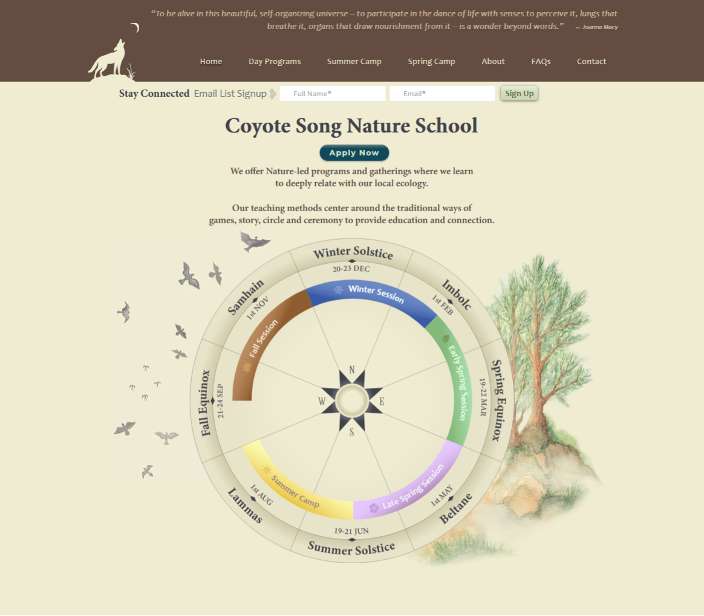
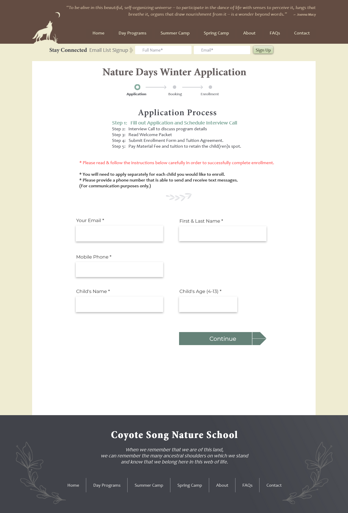
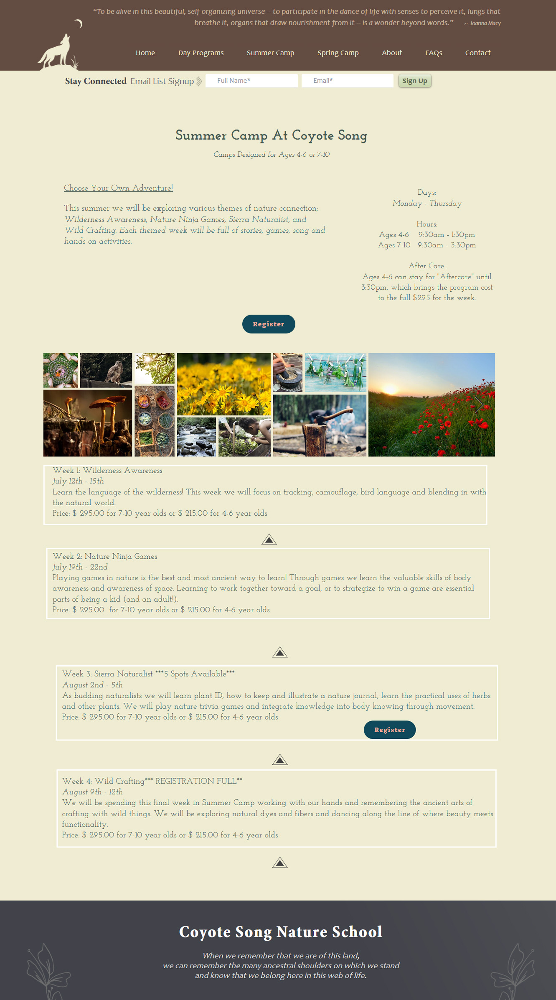

# Coyote Song
## Wilderness Learning for Children

Coyote Song was an innovative outdoor education program launched during the COVID-19 pandemic, offering children an immersive nature experience that reconnected them with the natural world through hands-on activities like animal tracking, bird watching, nature art, and fire tending, with a special emphasis on attuning to seasonal rhythms and collaborative outdoor learning.
 

### Coyote Song Landing Page

 

### Coyote Song About Us

 

### Coyote Song Application

 

### Coyote Song Enrollment Process - Checkout

 

### Coyote Song Info

